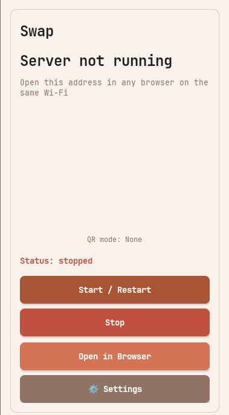
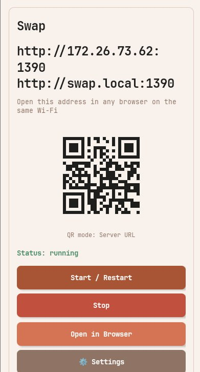
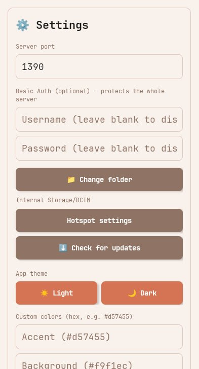
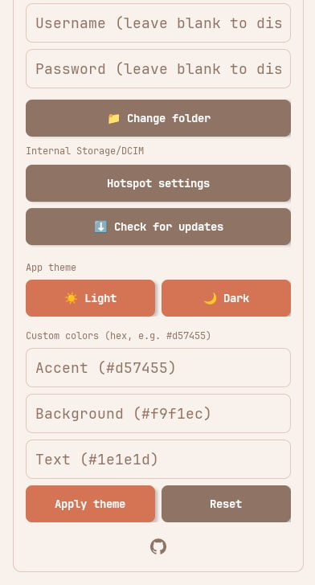
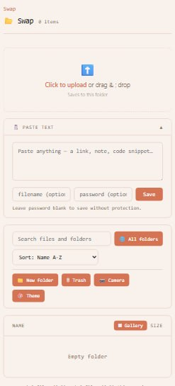
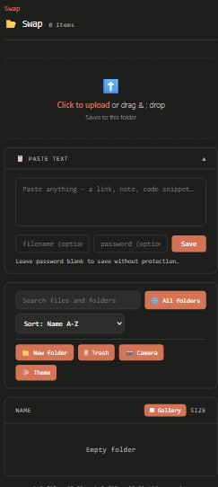

# Swap

<p align="center">
  
</p>

<p align="center">
  <b>Swap</b> is a Kotlin Android LAN file sharing app.
  <br/>
  Your phone runs a local HTTP server, and anyone on the same Wi-Fi can open the URL in a browser to upload, download, and manage files.
</p>

<p align="center">
  <a href="https://f-droid.org/packages/com.swap.app/"></a>
  <a href="https://github.com/Mobinshahidi/swap/releases"></a>
  
</p>

---

## What Swap Does

- Starts a local HTTP server on your phone (default port `1390`)
- Shows a browser URL like `http://192.168.1.5:1390` — plus `http://swap.local:1390` via mDNS, so nobody has to hunt for the IP
- Generates a QR code for easy connection from another device
- Serves a complete web file manager to any browser on the network
- Uses the Storage Access Framework (SAF) — you pick the shared folder, no broad storage permissions
- Runs as a foreground service so it keeps serving in the background, with wake/Wi-Fi locks for consistently fast LAN responses

---

## Screenshots

<p align="center">
  
  
  
</p>
<p align="center">
  
  
  
</p>

The same images double as the F-Droid listing screenshots — they are read
automatically from `fastlane/metadata/android/en-US/images/phoneScreenshots/`
(`1.jpg`, `2.jpg`, … in listing order).

---

## Download

- **F-Droid:** [`com.swap.app`](https://f-droid.org/packages/com.swap.app/)
- **GitHub Releases:** signed APKs (`swap-vX.Y.Z-release.apk`) are attached to every [release](https://github.com/Mobinshahidi/swap/releases)
- **CI artifacts:** every push to `main` builds an APK in the **Actions** tab

---

## Features

### File management (web UI)
- Folder navigation with breadcrumbs
- Upload: click, drag & drop, or **camera capture** straight from the browser
- Download single files, **ZIP of any selection**, or a **queued multi-file download** with per-file progress
- **New folder, rename, move** — full multi-select toolbar
- **Trash with undo**: delete moves items to a hidden trash; restore or empty it from the 🗑 Trash view
- **Search**: instant filter of the current folder, plus recursive **"All folders" search** across the whole share
- Sort by name / size / date, ascending or descending
- **Auto-refresh**: every open tab reloads automatically when the folder changes (cheap snapshot polling — no held-open connections)

### Viewing & media
- **In-browser preview** for images, video, audio, PDF, and text — click a file to preview instead of downloading
- **Video/audio seeking and resumable downloads** via HTTP Range (206 Partial Content)
- **Gallery view**: thumbnail grid for photo/video folders (SAF thumbnails, lazy-loaded)
- **Copy to clipboard** for text-file contents

### Sharing & access
- **Expiring / one-time share links** (`/s/<token>`) — hand someone a single file without giving them the password
- Optional **server-wide Basic Auth** (username/password) and **per-file passwords** (salted SHA-256)
- **Paste text** card: save a note/link/snippet as a `.txt` on the phone, optionally password-protected
- **Share-to-Swap**: Swap appears in Android's Share sheet; shared files import into the shared folder
- **mDNS discovery**: reachable at `http://swap.local:<port>` — no IP needed
- Session **transfer stats** (files and bytes, up/down)

### Theming
- Warm terracotta palette (`#d57455` family) as the default
- **Light / Dark presets plus a full custom color picker** (accent / background / text, hex or picker) — in the web UI *and* the native app; web themes persist per-browser, app themes in settings
- Theme-colored QR code (with a scannability guard)

### App (native)
- Minimal main screen: URL + QR, status, Start/Restart, Stop, Open in browser
- **Settings screen**: port, Basic Auth, shared-folder picker (SAF), hotspot shortcut, theme, GitHub link
- **Check for updates** against GitHub releases
- Unicode filenames throughout (Persian/Arabic/Chinese/…)

### Performance
Engineered for sub-second LAN page loads:
- Partial wake lock + Wi-Fi low-latency lock while serving (no radio power-save stalls)
- HTTP/1.1 keep-alive, TCP_NODELAY, 64 KB buffered writes
- Single-cursor SAF directory listing (one IPC round-trip per folder, not per file)

---

## Technical Stack

- **Language:** Kotlin — no frameworks, no Compose, no HTTP server library
- **Min SDK:** 26 · **Target/Compile SDK:** 34
- **Server:** hand-written HTTP/1.1 server on `ServerSocket` + coroutines
- **Storage:** Storage Access Framework (`DocumentsContract`)
- **Discovery:** jmdns (`_http._tcp`)
- **QR:** ZXing core
- **Build:** Gradle Kotlin DSL; CI on GitHub Actions; F-Droid reproducible builds

---

## Permissions

- `INTERNET` — accept browser connections from the LAN (the app makes no outgoing connections except the optional, user-triggered update check)
- `ACCESS_WIFI_STATE` / `CHANGE_WIFI_MULTICAST_STATE` — read the Wi-Fi IP; mDNS announcements
- `WAKE_LOCK` — keep CPU/Wi-Fi responsive while the server runs
- `FOREGROUND_SERVICE` (+ `DATA_SYNC`) — keep serving in the background

No broad storage permissions: folder access is granted per-folder through the SAF picker.

---

## Build in GitHub Actions (Recommended)

- **Every push**: `.github/workflows/build.yml` builds an APK (signed if secrets are set, debug otherwise).
- **Every `v*` tag**: `.github/workflows/release.yml` builds the signed release, names it `swap-vX.Y.Z-release.apk`, and publishes a GitHub Release — this is also what F-Droid's reproducible-build check verifies against.

### Required secrets for signed release APK

- `ANDROID_KEYSTORE_BASE64`
- `ANDROID_KEYSTORE_PASSWORD`
- `ANDROID_KEY_ALIAS`
- `ANDROID_KEY_PASSWORD`

---

## Local Development

```bash
./gradlew assembleDebug
adb install -r app/build/outputs/apk/debug/*.apk
```

---

## Project Structure

```text
.github/workflows/          build.yml (CI), release.yml (tagged releases)
app/src/main/java/com/lanshare/app/
  MainActivity.kt           main screen (URL, QR, start/stop)
  SettingsActivity.kt       port, auth, folder, theme, update check
  ServerService.kt          foreground service, wake/Wi-Fi locks, mDNS
  HttpServer.kt             HTTP/1.1 server: routing, uploads, Range, zip, share links, trash
  HtmlRenderer.kt           the entire web UI (HTML/CSS/JS)
  FileUtils.kt              SAF operations: list, read/write, search, thumbnails, trash
  PasswordManager.kt        Basic Auth + per-file passwords
  AppTheme.kt / AppPrefs.kt native theming + shared prefs keys
  QrCodeGenerator.kt        theme-colored QR
fastlane/metadata/          F-Droid store listing (descriptions, screenshots, changelogs)
fdroid-metadata-com.swap.app.yml   mirror of the fdroiddata recipe
```

---

## Security Notes

- Use Swap on trusted local networks — the server speaks plain HTTP (no TLS).
- Share links bypass auth by design; the unguessable token is the credential, and links expire (or burn after one use).
- Password-protected files use salted SHA-256 hash entries in `.passwords.json` (never served).
- Path traversal is blocked by server-side path normalization; `.passwords.json` and `.trash` are not directly accessible.

---

## Troubleshooting

- **Server URL not ready**: pick a shared folder (Settings → Change folder), then Start/Restart.
- **`swap.local` doesn't resolve**: some networks/hotspots block mDNS — use the IP URL or QR code.
- **APK install conflict**: uninstall old package if signatures differ: `adb uninstall com.swap.app`
- **No release artifact**: verify all 4 signing secrets are set correctly.

---

## License

This project is licensed under the MIT License.

- Full text: `LICENSE`
- Copyright: `2026 Mobin Shahidi`
